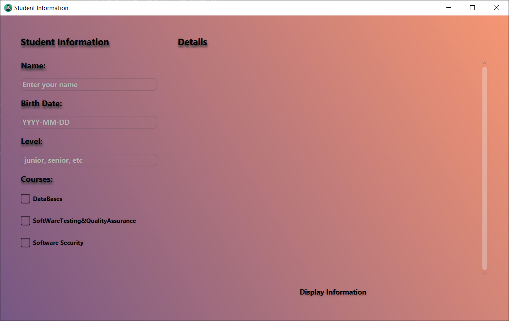
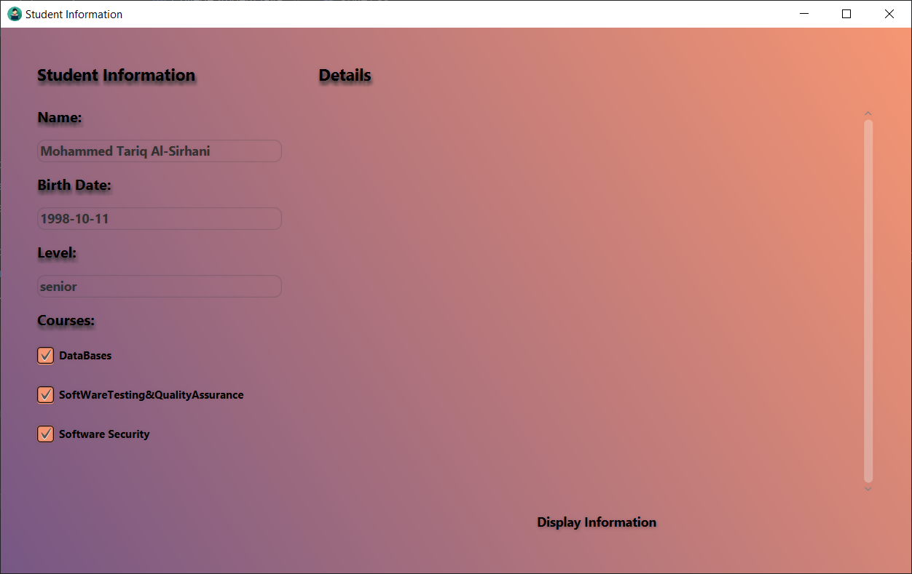
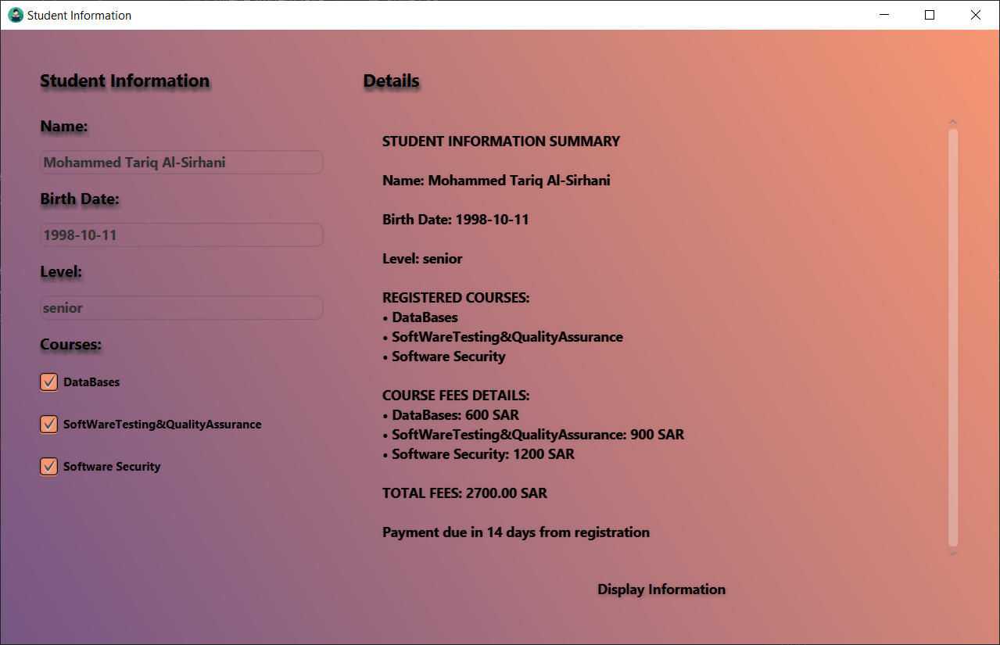

# 🎓 Student Information System

This is a simple desktop application that allows users to enter student details, select courses, and automatically calculate the total course fees. The app displays a complete summary of the student’s information in a clear and structured format.

---

## 💡 What It Does

- Takes student details like **name**, **birth date**, and **level**
- Allows selection of multiple courses
- Calculates total course fees based on selected courses
- Displays a summary including all selected courses and the total amount due
- Shows a payment reminder message

---

## ✨ Features

- Simple and user-friendly interface
- Real-time calculation of total course fees
- Supports multiple course selections
- Displays organized and clear student summary
- Useful for basic student record management and training

---

## 🖼️ Screenshots





---

## 🚀 How to Run

1. Clone the repository:
   ```bash
   git clone https://github.com/Sir7an/CollageStudent.git
